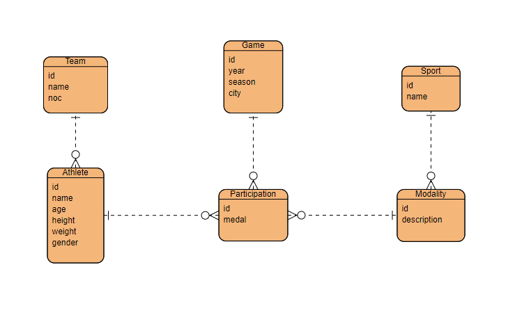

# Teste Olympic History

### 📝 Descrição

Este projeto faz parte de um teste de Back-end. Ele consiste em um crud com base nas informações do dataset “120 years of
Olympic history: athletes and results” presente no [Kaggle](https://www.kaggle.com/heesoo37/120-years-of-olympic-history-athletes-and-results#athlete_events.csv). A partir dos dados presentes nas colunas do csv, foi conceituado e criado um modelo relacional com a seguinte arquitetura:



## 💻 Pré-requisitos

Antes de começar, verifique se você atendeu aos seguintes requisitos:
* Você possui `Python 3+`
* Você possui `Poetry`
* Você possui `PostgreSQL 9.4`.

## 🚀 Instalando teste_celero

Para instalar o teste_celero, siga estas etapas:

Primeiramente, crie um arquivo `.env` na raiz do projeto. Abrindo ele, insira as seguintes variáveis de ambiente substituindo os valores entre `<>` para os seus valores locais:
```
SECRET_KEY=<sua_secret_key>
DATABASE_URL="postgres://<usuario_postgres>:<senha_postgres>@localhost:5432/<nome_banco>"
```

Após isso, basta rodar o seguinte comando para criar a virtual environment:
```
poetry install
```

Uma vez estando na raiz do projeto. Rode o seguinte comando para iniciar a importação dos dados, que estão em `data/athlete_events.csv`, para o banco do projeto:

```
python manage.py importcsvdata
```
Você também pode passar o argumento opcional `lines_to_read` para, assim, ler uma quantidade limitada de linhas do csv. Com isso, o comando irá ficar assim, por exemplo:
```
python manage.py importcsvdata --lines_to_read 1000
```
>❗ Como o comando trata do caminho para o csv internamente, caso queira inserir seus próprios dados seguindo a mesma arquitetura da base de dados original, basta substituir o arquivo em `data/` utilizando o mesmo nome: `athlete_events.csv`.

Com isso, o projeto está devidamente instalado. Agora basta rodar o seguinte comando para iniciar o `Django Server`:
```
python manage.py runserver
```

Finalmente o projeto estará rodando no seu [localhost](http://localhost:8000/admin).

## ☕ Usando o Projeto

Após rodar o `Django Server`, para acessar o `Django Admin`, você precisará criar o superusuário. Para isso, basta rodar o seguinte comando:
```
python manage.py createsuperuser
```
Após isso, você irá poder manipular e acessar os dados das tabelas de maneira mais rápida.

O projeto também possui suporte para Swagger Docs. Basta acessar a rota [http://localhost:8000/swagger-ui/](http://localhost:8000/swagger-ui/). Nele você vai ter acesso à todas as rotas da api rest que o projeto possui, junto com cada schema de cada rota. Confira a seguir uma explicação sobre cada pacote de rotas:

- **Athlete**: É o conjunto de rotas que você irá poder manipular os atletas com suas respectivas participações.
- **Team**: É o conjunto de rotas que você irá poder manipular os times.
- **Modality**: É o conjunto de rotas que você irá poder manipular as modalidades junto com seus respectivos esportes.
- **Sport**: É o conjunto de rotas que você irá poder manipular os esportes.
- **Game**: É o conjunto de rotas que vocÊ irá poder manipular os jogos olímpicos.

Todas as rotas possuem filtros próprios, onde podem ser visualizados no detalhar da rota do Swagger Docs.

## :checkered_flag: Disposição Finais
O projeto possui testes unitários automatizados. Para checa-los basta rodar o comando:
```
python manage.py test
```

O projeto também está alocado remotamente no `Heroku`. Para acessar basta clicar neste [link](https://teste-celero.herokuapp.com/swagger-ui/).
